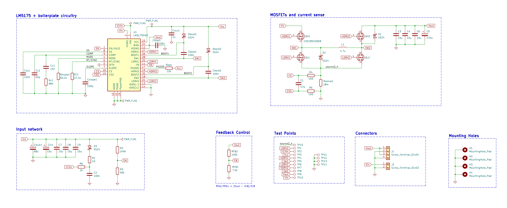
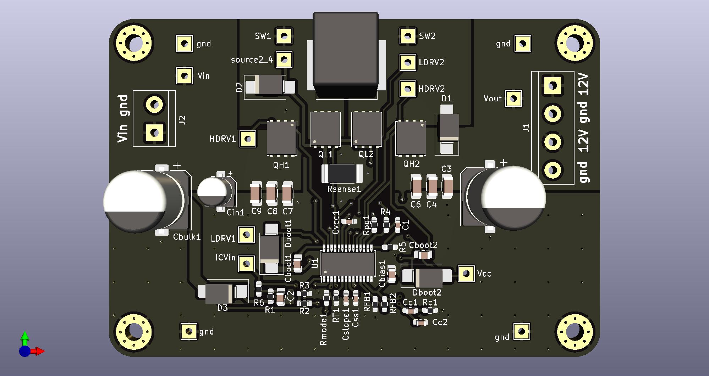
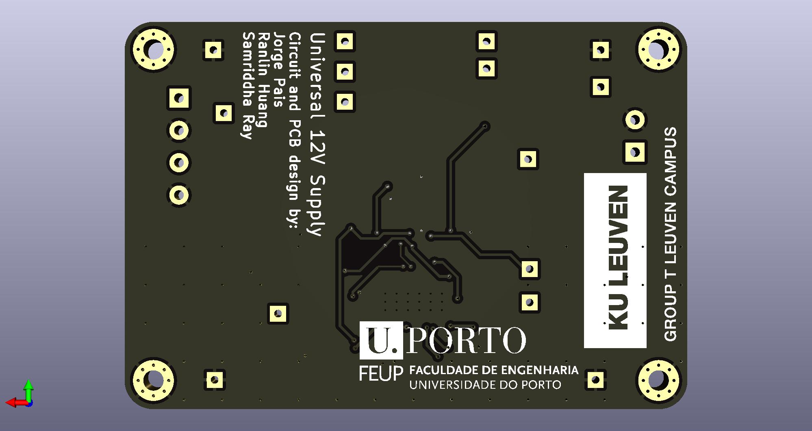

# Power Electronics - Final Project

This project is a simple and efficient universal 12V switch mode power supply circuit, designed and built for the final project of the Power Electronics Course at KU Leuven - Group T. It is designed around Texas Instruments' LM5175 buck-boost controller IC in order to provide currents up to 2A with an input voltage ranging from 4V to 24V.

## Circuit and PCB

Both the schematic capture and PCB design were done utilizing KiCad 7. These project files can be found the `universal12Vsupply` folder.

It is possible to preview the project online without KiCad through [KiCanvas](https://kicanvas.org/?github=https%3A%2F%2Fgithub.com%2Fjorge-pais%2FPE_universal12Vsupply%2Ftree%2Fmain%2Funiversal12Vsupply).

#### Front View

#### Back View

## Credits

This project was the collaborative effort of the following team members:

- Jorge Pais
- Ranlin Huang
- Samriddha Ray

Their hard work and dedication made this project a success.

## License

This project is licensed under the [Open Source Hardware License 2](LICENSE.md)
