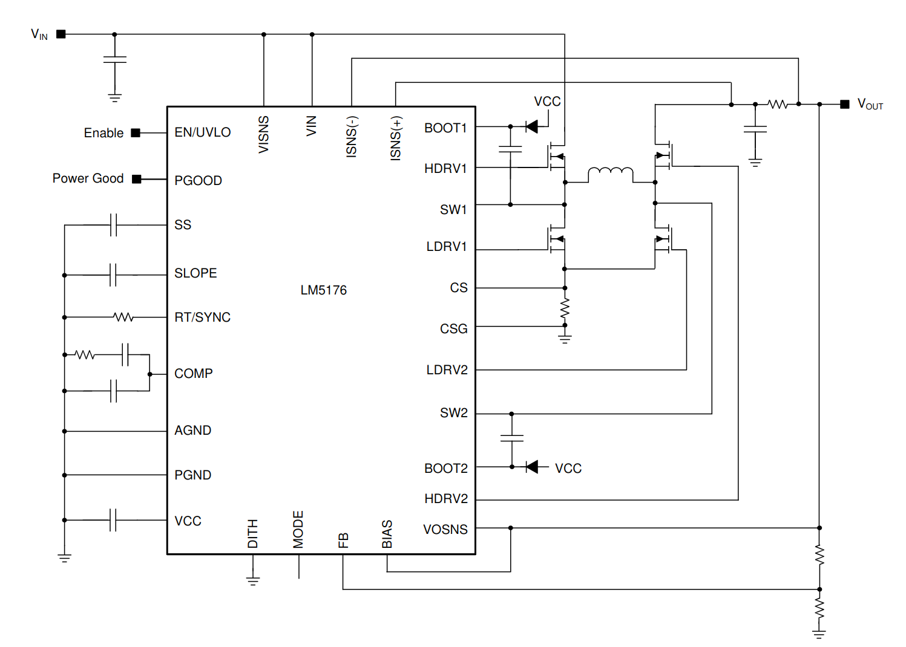

# Power Electronics Project - Design

***Theme:*** Universal 12V supply. IN: 5-18V. OUT: 12V, 1A

For all the calculations, the components were overdimensioned considering IN: 4-24V and Iout of 2A  

Given the input/output requirements, a step-up-down configuration is needed. By looking at some major manufacturers of power management ICs, the LM5176 buck-boost controller was chosen because although it requires external switching through MOSFETs.

https://be.farnell.com/en-BE/texas-instruments/lm5176pwpt/dc-dc-ctrl-sync-buck-boost-htssop/dp/3008671?st=LM5176PWPT

In the datasheet, a simple buck boost implementation is shown as figure 8-1.

### Design

#### Frequency

As per the majority datasheet information and examples, we'll use a switching frequency $F_{SW} = 300 \text{kHz}$. As such, the $R_{T}$ resistor must be of value $27.4\text k \Omega$.

#### Vout

The output voltage is set using a resistor devider to the FB pin. The internal reference voltage is 0.8V.

$$\frac{R_{FB2}}{R_{FB1}} = \frac{V_{out}-0.8}{0.8} = 14$$

If we use resistors from the E48 value series we get a perfect resistor ratio using:

$$R_{FB1} = 7.5 \text k \Omega; R_{FB2} = 105 \text k \Omega$$

#### Inductor Selection

The target inductance for Buck mode is:

$$L_{buck} = \frac{(V_{inMAX}-V_{out})V_{out}}{0.4I_{outMAX}F_{SW}V_{inMAX}} = 25 \mu \text H$$

And the target inductance for boost mode is:

$$L_{boost} = \frac{V_{inMIN}^2 (V_{out}-V_{inMIN})}{0.3I_{outMAX}F_{SW}V_{out}^2}= 4.93 \mu \text H$$

And the maximum average inductor current is (assuming 90\%) efficiency:

$$I_{Lmax} = \frac{V_{out}I_{outMAX}}{0.9V_{inMIN}}= 6.66\text A$$

Given this, and that the datasheet also under specs this component quite a bit, the following $4.7\mu \text H$ inductor can be utilized: https://be.farnell.com/en-BE/bourns/srp1038a-4r7m/inductor-4-7uh-20-10a-shielded/dp/2434028

$$I_{Lpeak} = I_{Lmax} + \frac{V_{inMIN}(V_{out}-V_{inMIN})}{2L_1F_{sw}V_{out}} \approx 6.66 \text A$$

#### Output Capacitor

The output capacitor can be determined by the capacitive ripple voltage:

$$\Delta V_{ripple} = \frac{I_{out}(1-\frac{V_{inMIN}}{V_{out}})}{C_{out}F_{SW}}$$

So for a 10 mV ripple from the capacitor, a value of $444.44\mu \text F$ is required. As such $C_{out} = 470\mu \text F$  

#### MOSFETs
The csd18532 is a good mosfet option with high current handling capabilities and and enough Vds to handle the maximum input voltage.
https://be.farnell.com/en-BE/texas-instruments/csd18532q5b/mosfet-n-ch-60v-100a-vson-8/dp/3009663?st=CSD18532Q5B

#### Rsense

$$R_{senseBUCK} = \frac{80\text{mV}}{I_{outMAX}} = 40\text m\Omega$$

$$R_{senseBOOST} = \frac{120\text{mV}}{I_{Lpeak}} = 18\text m\Omega$$

This value is then set to $R_{sense} = 18\text m\Omega$ based on the boost mode operation.

The power loss experienced by the $R_{sense}$ is the following:

$$P_{senseMAX} = (120mV/R_{sense})^2*R_{sense}*(1-V_{inMIN}/V_{out}) = 0.53 \text W$$

Hence a 1W sense resistor is sufficient

#### Frequency Compensation

At the maximum load of 2A, output resistance is $R_{out} = V_{out}/I_{outMAX} 6\Omega$

$$f_{p1(boost)} = \frac{2}{2\pi R_{out}C_{out}} = 112 \text{Hz}$$

$$f_{z1} = \frac{1}{2\pi R_{esr}C_{out}} = 226 \text{Hz} $$

The boost power stage RHP zero location is given by: 

$$f_{RHP} = \frac{R_{out}(1-D_{max})^2}{2\pi L_1} = 22.57\text{kHz}$$

Where $D_{max}$ is the maximum duty cycle at the minimum $V_{in}$: $D = 1-\frac{V_i}{V_o} = 0.667$ 

$$f_{p1(buck)} = \frac{1}{2\pi R_{out}C_{out}} = 56.4379$$

From these, it is clear that the RHP zero is the main factor limiting the achievable bandwidth.

$$f_{bw} = \frac{f_{RHP}}{3} = 7.52\text{kHz}$$

The compensation zero can be placed at 1.5 times the boost frequency pole.

$$f_{zc} = 1.5f_{p1(boost)} = 168\text{Hz}$$

Then the values for $R_{c1}, C_{c1} and C_{c2}$ can be figured out through the following expressions:

$$R_{c1} = \frac{2\pi f_{bw}}{gm_{EA}}\frac{R_{FB1}+R_{FB2}}{R_{FB1}}\frac{A_{cs}R_{sense}C_{out}}{1-D_{max}} = 68656\Omega \approx 68\text k \Omega$$

$$C_{c1} = \frac{1}{2\pi f_{zc} R_{c1}} = 13.79 \text{nF} \approx 13 \text{nF}$$

$$C_{c2} = \frac{1}{2\pi 5 f_{bw} R_{c1}} = 61.65 \text{pF} \approx 62 \text{pF}$$

#### Soft start

For a 20ms soft-start:

$I_{ss} = 5\mu \text A$

$$C_{ss} = \frac{t_{ss}I_{ss}}{V_{ref}} = 125 nF = 120n $$

#### Slope compensation

$$C_{slope} = gm_{slope}\frac{L1}{R_{sense}A_{cs}} = 100pF$$

#### Diodes

For all the diodes needed by the circuit, the MULTICOMP PRO SS24 schottky barrier rectifier was selected:

https://be.farnell.com/en-BE/multicomp/ss24/schottky-rectifier-2a-40v-do-214aa/dp/2675138?MER=sy-me-pd-mi-alte
